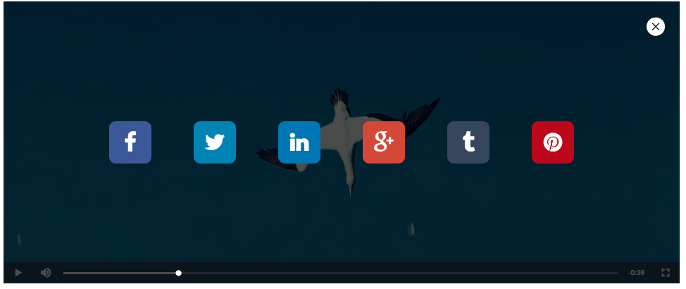

# videojs-social-media

Social media button




## Installation

```sh
npm install --save videojs-social-media
```

## Usage

To include videojs-social-media on your website or web application, use any of the following methods.

### `<script>` Tag

This is the simplest case. Get the script in whatever way you prefer and include the plugin _after_ you include [video.js][videojs], so that the `videojs` global is available.

```html
<script src="//path/to/video.min.js"></script>
<script src="//path/to/videojs-social-media.min.js"></script>
<script>
  var player = videojs('my-video');

  player.socialMedia({
     links: [
       {
         name: "facebook",
         url: "http://www.guiarte.com/"
       }, {
         name: "twitter",
         url: "http://www.guiarte.com/",
         text: 'Miren este link',
         hashtags: 'americatv,laranapepe'
       }, {
         name: "linkedin",
         url: "http://www.guiarte.com/",
         title: 'Miren esta informacion',
         summary: 'Descripcion de la nota'
       },{
         name: "gplus",
         url: "http://www.guiarte.com/"
       }, {
         name: "tumblr",
         url: "http://www.guiarte.com/",
       }, {
         name: "pinterest",
         url: "http://www.guiarte.com/",
         summary: 'Descripcion de la nota'
       }]
   });
</script>
```

### Browserify/CommonJS

When using with Browserify, install videojs-social-media via npm and `require` the plugin as you would any other module.

```js
var videojs = require('video.js');

// The actual plugin function is exported by this module, but it is also
// attached to the `Player.prototype`; so, there is no need to assign it
// to a variable.
require('videojs-social-media');

var player = videojs('my-video');

player.socialMedia();
```

### RequireJS/AMD

When using with RequireJS (or another AMD library), get the script in whatever way you prefer and `require` the plugin as you normally would:

```js
require(['video.js', 'videojs-social-media'], function(videojs) {
  var player = videojs('my-video');

  player.socialMedia();
});
```

## License

Apache-2.0. Copyright (c) ffernandez &lt;ffernandez@app-con.com&gt;


[videojs]: http://videojs.com/
